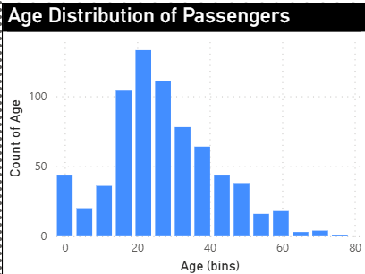
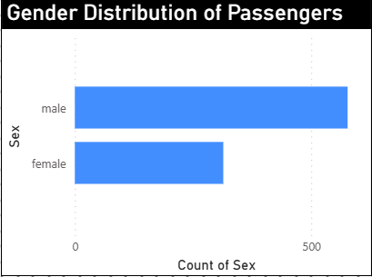

# PRODIGY_INFOTECH INTERNSHIP TASK-1

## Overview
This project demonstrates the use of **Power BI Desktop** to analyze and visualize Titanic passenger data.  
The goal is to create visualizations showing distributions and insights in the dataset.

---

## Dataset
- **File:** `Titanic.csv`  
- **Columns include:** Age, Gender, Survived, Class, etc.

---

## Visualizations

| Age Distribution | Gender Distribution |
|-----------------|-------------------|
|  |  |

---

## Tools & Skills
- **Power BI Desktop** – Creating interactive charts and dashboards  
- **Data Analysis** – Understanding distributions, trends, and categorical data  
- **Git & GitHub** – Version control and project sharing

---

## Notes
- Main project file: `PRODIGY_DS_01.pbix`  
- Additional screenshots and dataset included for reference  

---
## Author
**Poojitha Sree**  
[LinkedIn](https://www.linkedin.com/in/poojithasree-mudavath)
 
